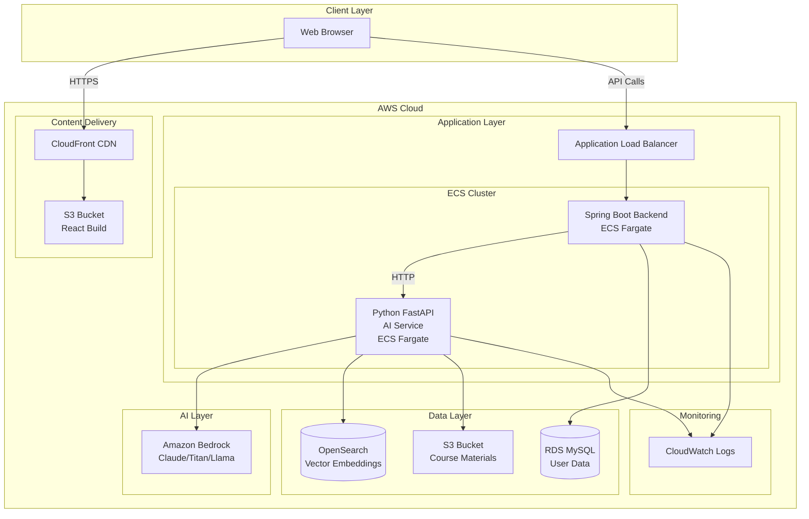
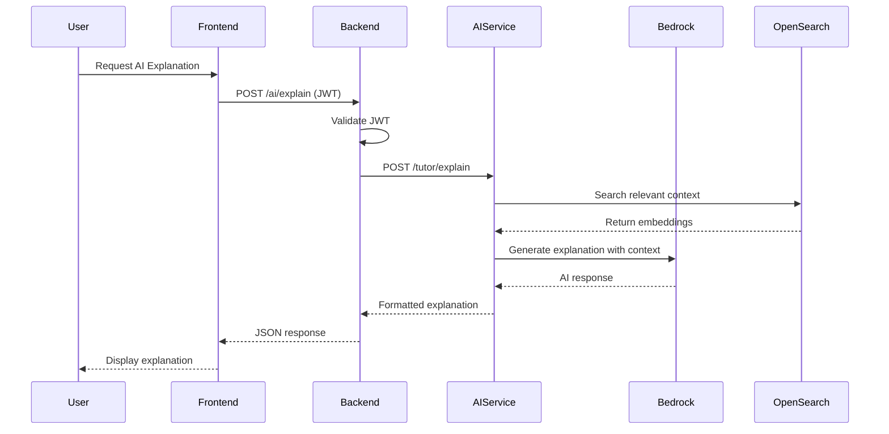
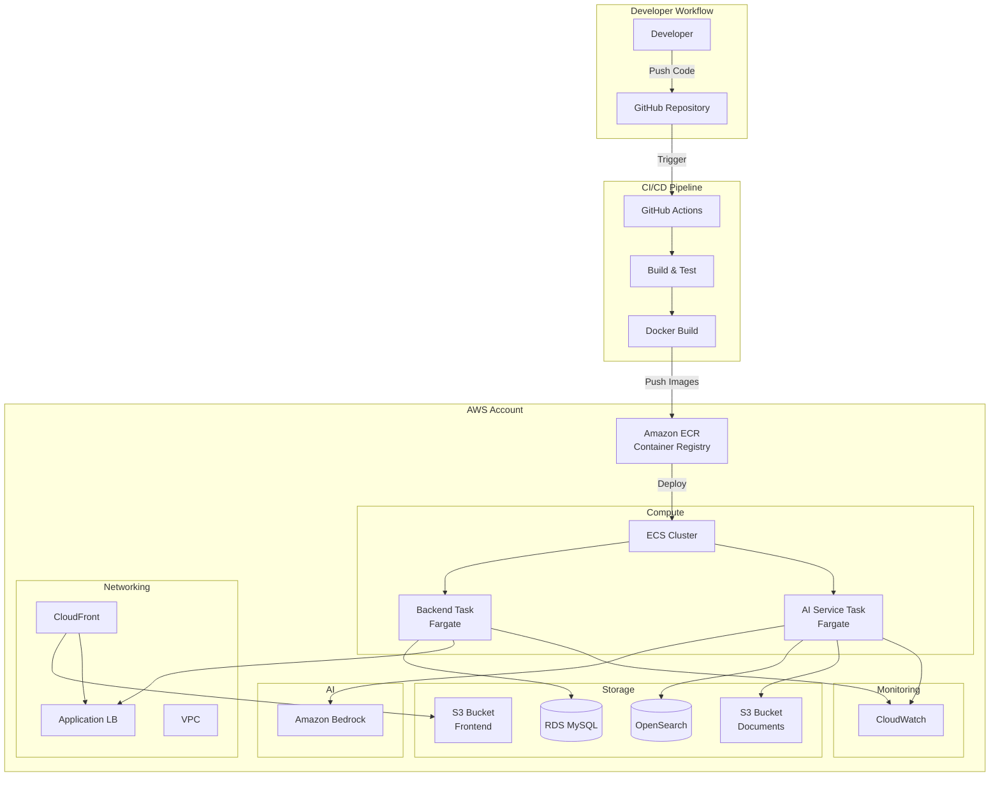

# Design Document: SkillForge AI+ Platform Extension

## Overview

This design extends the existing SkillForge AI+ platform with comprehensive AI capabilities through a microservice architecture. The system introduces a Python FastAPI AI service that integrates with Amazon Bedrock for AI model inference, extends the Spring Boot backend with new AI endpoints, implements a RAG pipeline using Amazon OpenSearch for knowledge retrieval, adds React frontend pages for AI features, and deploys the entire system on AWS infrastructure.

The design preserves existing authentication mechanisms and frontend structure while adding new capabilities for AI tutoring, quiz generation, code debugging, and adaptive learning based on user performance.

## Architecture

### System Architecture Diagram



### Microservice Architecture

The system follows a microservice pattern with three main services:

1. **Frontend (React)**: User interface served via CloudFront CDN
2. **Backend (Spring Boot)**: API gateway and business logic
3. **AI Service (Python FastAPI)**: AI operations and Bedrock integration

### Communication Flow



## Components and Interfaces

### 1. AI Service (Python FastAPI)

**Directory Structure:**
```
ai_service/
├── main.py              # FastAPI application entry point
├── tutor.py             # AI tutoring logic
├── quiz.py              # Quiz generation logic
├── debugger.py          # Code debugging logic
├── rag.py               # RAG pipeline implementation
├── embeddings.py        # Embedding generation and storage
├── bedrock_client.py    # Bedrock API wrapper
├── config.py            # Configuration management
├── models.py            # Pydantic data models
├── requirements.txt     # Python dependencies
└── Dockerfile           # Container definition
```

**API Endpoints:**

```python
# POST /tutor/explain
{
  "topic": "string",
  "user_id": "string"
}
# Response: { "explanation": "string", "examples": [], "analogy": "string" }

# POST /quiz/generate
{
  "topic": "string",
  "difficulty": "easy|medium|hard",
  "count": "integer"
}
# Response: { "questions": [{ "question": "string", "options": [], "correct": "integer" }] }

# POST /debug/analyze
{
  "language": "string",
  "code": "string"
}
# Response: { "errors": [], "corrected_code": "string", "explanation": "string" }

# POST /rag/upload
{
  "file_url": "string",
  "metadata": {}
}
# Response: { "status": "success", "chunks_processed": "integer" }

# GET /rag/search
{
  "query": "string",
  "top_k": "integer"
}
# Response: { "results": [{ "content": "string", "score": "float", "metadata": {} }] }
```

**Bedrock Integration:**

```python
import boto3
from botocore.config import Config

class BedrockClient:
    def __init__(self, region: str, model_id: str):
        self.config = Config(
            region_name=region,
            retries={'max_attempts': 3, 'mode': 'adaptive'}
        )
        self.client = boto3.client('bedrock-runtime', config=self.config)
        self.model_id = model_id
    
    def invoke_model(self, prompt: str, max_tokens: int = 2000) -> str:
        """Invoke Bedrock model with prompt"""
        body = {
            "prompt": prompt,
            "max_tokens_to_sample": max_tokens,
            "temperature": 0.7,
            "top_p": 0.9
        }
        response = self.client.invoke_model(
            modelId=self.model_id,
            body=json.dumps(body)
        )
        return json.loads(response['body'].read())['completion']
```

**Prompt Template System:**

```python
class PromptTemplates:
    TUTOR = """You are an expert programming tutor.
Explain the following concept in simple language.

Include:
- Step-by-step explanation
- Real-world analogy
- Example code with comments

Topic: {topic}

Context from course materials:
{context}
"""

    QUIZ = """Generate {count} multiple choice questions on the topic: {topic}

Difficulty: {difficulty}

Return JSON format:
[
  {{
    "question": "...",
    "options": ["A", "B", "C", "D"],
    "correct": 0,
    "explanation": "..."
  }}
]
"""

    DEBUGGER = """You are a senior software engineer.

Analyze the following {language} code.
Identify errors and provide corrected code.

Code:
{code}

Return JSON format:
{{
  "errors": [{{ "line": 0, "message": "..." }}],
  "corrected_code": "...",
  "explanation": "..."
}}
"""
```

### 2. Backend Extension (Spring Boot)

**New Controller:**

```java
@RestController
@RequestMapping("/ai")
public class AIController {
    
    @Autowired
    private AIServiceClient aiServiceClient;
    
    @Autowired
    private UserProgressService userProgressService;
    
    @PostMapping("/explain")
    public ResponseEntity<ExplanationResponse> explainConcept(
        @RequestBody ExplainRequest request,
        @AuthenticationPrincipal UserDetails userDetails
    ) {
        // Validate input
        if (request.getTopic() == null || request.getTopic().isEmpty()) {
            return ResponseEntity.badRequest().build();
        }
        
        // Call AI service
        ExplanationResponse response = aiServiceClient.explain(request.getTopic());
        
        // Log interaction
        userProgressService.logInteraction(userDetails.getUsername(), request.getTopic());
        
        return ResponseEntity.ok(response);
    }
    
    @PostMapping("/quiz")
    public ResponseEntity<QuizResponse> generateQuiz(
        @RequestBody QuizRequest request,
        @AuthenticationPrincipal UserDetails userDetails
    ) {
        // Validate input
        if (request.getCount() < 1 || request.getCount() > 20) {
            return ResponseEntity.badRequest().body(
                new ErrorResponse("Count must be between 1 and 20")
            );
        }
        
        // Call AI service
        QuizResponse response = aiServiceClient.generateQuiz(
            request.getTopic(),
            request.getDifficulty(),
            request.getCount()
        );
        
        return ResponseEntity.ok(response);
    }
    
    @PostMapping("/debug")
    public ResponseEntity<DebugResponse> debugCode(
        @RequestBody DebugRequest request,
        @AuthenticationPrincipal UserDetails userDetails
    ) {
        // Call AI service
        DebugResponse response = aiServiceClient.debugCode(
            request.getLanguage(),
            request.getCode()
        );
        
        return ResponseEntity.ok(response);
    }
    
    @GetMapping("/recommendations")
    public ResponseEntity<RecommendationsResponse> getRecommendations(
        @AuthenticationPrincipal UserDetails userDetails
    ) {
        // Get user progress
        List<UserProgress> progress = userProgressService.getUserProgress(
            userDetails.getUsername()
        );
        
        // Apply adaptive learning rules
        List<Recommendation> recommendations = adaptiveLearningEngine.generateRecommendations(progress);
        
        return ResponseEntity.ok(new RecommendationsResponse(recommendations));
    }
}
```

**AI Service Client:**

```java
@Service
public class AIServiceClient {
    
    @Value("${ai.service.url}")
    private String aiServiceUrl;
    
    private final RestTemplate restTemplate;
    
    public AIServiceClient(RestTemplateBuilder builder) {
        this.restTemplate = builder
            .setConnectTimeout(Duration.ofSeconds(10))
            .setReadTimeout(Duration.ofSeconds(30))
            .build();
    }
    
    public ExplanationResponse explain(String topic) {
        String url = aiServiceUrl + "/tutor/explain";
        ExplainRequest request = new ExplainRequest(topic);
        
        try {
            return restTemplate.postForObject(url, request, ExplanationResponse.class);
        } catch (RestClientException e) {
            throw new AIServiceException("Failed to get explanation", e);
        }
    }
    
    // Similar methods for quiz and debug
}
```

**Adaptive Learning Engine:**

```java
@Service
public class AdaptiveLearningEngine {
    
    public List<Recommendation> generateRecommendations(List<UserProgress> progressList) {
        List<Recommendation> recommendations = new ArrayList<>();
        
        for (UserProgress progress : progressList) {
            double accuracy = progress.getAccuracy();
            String topic = progress.getTopic();
            
            if (accuracy < 0.5) {
                recommendations.add(new Recommendation(
                    topic,
                    "EASIER",
                    "Review fundamentals of " + topic
                ));
            } else if (accuracy >= 0.5 && accuracy <= 0.8) {
                recommendations.add(new Recommendation(
                    topic,
                    "PRACTICE",
                    "Practice more questions on " + topic
                ));
            } else {
                recommendations.add(new Recommendation(
                    topic,
                    "ADVANCE",
                    "Ready to move to next topic"
                ));
            }
        }
        
        return recommendations;
    }
}
```

### 3. RAG Pipeline Implementation

**Document Processing:**

```python
class RAGPipeline:
    def __init__(self, s3_client, bedrock_client, opensearch_client):
        self.s3 = s3_client
        self.bedrock = bedrock_client
        self.opensearch = opensearch_client
        self.chunk_size = 500
        self.chunk_overlap = 50
    
    async def process_document(self, s3_key: str, metadata: dict):
        """Process document from S3 and store embeddings"""
        # Download from S3
        content = self.s3.get_object(Bucket=BUCKET_NAME, Key=s3_key)['Body'].read()
        text = self.extract_text(content)
        
        # Split into chunks
        chunks = self.split_text(text, self.chunk_size, self.chunk_overlap)
        
        # Generate embeddings
        embeddings = []
        for i, chunk in enumerate(chunks):
            embedding = await self.generate_embedding(chunk)
            embeddings.append({
                'id': f"{s3_key}_{i}",
                'content': chunk,
                'embedding': embedding,
                'metadata': {**metadata, 'chunk_index': i}
            })
        
        # Store in OpenSearch
        await self.store_embeddings(embeddings)
        
        return len(embeddings)
    
    def split_text(self, text: str, chunk_size: int, overlap: int) -> List[str]:
        """Split text into overlapping chunks"""
        chunks = []
        start = 0
        while start < len(text):
            end = start + chunk_size
            chunks.append(text[start:end])
            start = end - overlap
        return chunks
    
    async def generate_embedding(self, text: str) -> List[float]:
        """Generate embedding using Bedrock Titan Embeddings"""
        response = self.bedrock.client.invoke_model(
            modelId='amazon.titan-embed-text-v1',
            body=json.dumps({'inputText': text})
        )
        return json.loads(response['body'].read())['embedding']
    
    async def search(self, query: str, top_k: int = 5) -> List[dict]:
        """Search for relevant context"""
        # Generate query embedding
        query_embedding = await self.generate_embedding(query)
        
        # Search OpenSearch
        search_body = {
            'size': top_k,
            'query': {
                'knn': {
                    'embedding': {
                        'vector': query_embedding,
                        'k': top_k
                    }
                }
            }
        }
        
        response = self.opensearch.search(
            index='course_materials',
            body=search_body
        )
        
        return [
            {
                'content': hit['_source']['content'],
                'score': hit['_score'],
                'metadata': hit['_source']['metadata']
            }
            for hit in response['hits']['hits']
        ]
```

**Context-Aware AI Responses:**

```python
class ContextualTutor:
    def __init__(self, rag_pipeline: RAGPipeline, bedrock_client: BedrockClient):
        self.rag = rag_pipeline
        self.bedrock = bedrock_client
    
    async def explain_with_context(self, topic: str) -> dict:
        """Generate explanation with retrieved context"""
        # Retrieve relevant context
        context_results = await self.rag.search(topic, top_k=3)
        context = "\n\n".join([r['content'] for r in context_results])
        
        # Build prompt with context
        prompt = PromptTemplates.TUTOR.format(
            topic=topic,
            context=context
        )
        
        # Generate explanation
        explanation = self.bedrock.invoke_model(prompt)
        
        # Parse and structure response
        return {
            'explanation': explanation,
            'sources': [r['metadata'] for r in context_results]
        }
```

### 4. Frontend Components (React)

**TutorPage Component:**

```typescript
import React, { useState } from 'react';
import { useAuth } from '../hooks/useAuth';
import { apiClient } from '../services/api';

interface ExplanationResponse {
  explanation: string;
  examples: string[];
  analogy: string;
  sources?: any[];
}

export const TutorPage: React.FC = () => {
  const [topic, setTopic] = useState('');
  const [loading, setLoading] = useState(false);
  const [result, setResult] = useState<ExplanationResponse | null>(null);
  const [error, setError] = useState<string | null>(null);
  const { token } = useAuth();

  const handleExplain = async () => {
    if (!topic.trim()) {
      setError('Please enter a topic');
      return;
    }

    setLoading(true);
    setError(null);

    try {
      const response = await apiClient.post<ExplanationResponse>(
        '/ai/explain',
        { topic },
        { headers: { Authorization: `Bearer ${token}` } }
      );
      setResult(response.data);
    } catch (err: any) {
      setError(err.response?.data?.message || 'Failed to get explanation');
    } finally {
      setLoading(false);
    }
  };

  return (
    <div className="tutor-page">
      <h1>AI Tutor</h1>
      <div className="input-section">
        <input
          type="text"
          value={topic}
          onChange={(e) => setTopic(e.target.value)}
          placeholder="Enter a topic to learn about..."
          disabled={loading}
        />
        <button onClick={handleExplain} disabled={loading}>
          {loading ? 'Generating...' : 'Explain'}
        </button>
      </div>

      {error && <div className="error">{error}</div>}

      {result && (
        <div className="result-section">
          <div className="explanation">
            <h2>Explanation</h2>
            <p>{result.explanation}</p>
          </div>
          {result.analogy && (
            <div className="analogy">
              <h3>Analogy</h3>
              <p>{result.analogy}</p>
            </div>
          )}
          {result.examples && result.examples.length > 0 && (
            <div className="examples">
              <h3>Examples</h3>
              {result.examples.map((example, idx) => (
                <pre key={idx}><code>{example}</code></pre>
              ))}
            </div>
          )}
        </div>
      )}
    </div>
  );
};
```

**QuizPage Component:**

```typescript
import React, { useState } from 'react';
import { useAuth } from '../hooks/useAuth';
import { apiClient } from '../services/api';

interface Question {
  question: string;
  options: string[];
  correct: number;
  explanation: string;
}

interface QuizResponse {
  questions: Question[];
}

export const QuizPage: React.FC = () => {
  const [topic, setTopic] = useState('');
  const [difficulty, setDifficulty] = useState<'easy' | 'medium' | 'hard'>('medium');
  const [count, setCount] = useState(5);
  const [quiz, setQuiz] = useState<Question[] | null>(null);
  const [currentQuestion, setCurrentQuestion] = useState(0);
  const [selectedAnswers, setSelectedAnswers] = useState<number[]>([]);
  const [showResults, setShowResults] = useState(false);
  const [loading, setLoading] = useState(false);
  const { token } = useAuth();

  const handleGenerateQuiz = async () => {
    setLoading(true);
    try {
      const response = await apiClient.post<QuizResponse>(
        '/ai/quiz',
        { topic, difficulty, count },
        { headers: { Authorization: `Bearer ${token}` } }
      );
      setQuiz(response.data.questions);
      setCurrentQuestion(0);
      setSelectedAnswers([]);
      setShowResults(false);
    } catch (err) {
      console.error('Failed to generate quiz', err);
    } finally {
      setLoading(false);
    }
  };

  const handleAnswerSelect = (answerIndex: number) => {
    const newAnswers = [...selectedAnswers];
    newAnswers[currentQuestion] = answerIndex;
    setSelectedAnswers(newAnswers);
  };

  const handleNext = () => {
    if (currentQuestion < quiz!.length - 1) {
      setCurrentQuestion(currentQuestion + 1);
    } else {
      setShowResults(true);
    }
  };

  const calculateScore = () => {
    if (!quiz) return 0;
    let correct = 0;
    quiz.forEach((q, idx) => {
      if (selectedAnswers[idx] === q.correct) correct++;
    });
    return (correct / quiz.length) * 100;
  };

  return (
    <div className="quiz-page">
      <h1>AI Quiz Generator</h1>
      
      {!quiz && (
        <div className="quiz-setup">
          <input
            type="text"
            value={topic}
            onChange={(e) => setTopic(e.target.value)}
            placeholder="Topic"
          />
          <select value={difficulty} onChange={(e) => setDifficulty(e.target.value as any)}>
            <option value="easy">Easy</option>
            <option value="medium">Medium</option>
            <option value="hard">Hard</option>
          </select>
          <input
            type="number"
            value={count}
            onChange={(e) => setCount(parseInt(e.target.value))}
            min="1"
            max="20"
          />
          <button onClick={handleGenerateQuiz} disabled={loading}>
            Generate Quiz
          </button>
        </div>
      )}

      {quiz && !showResults && (
        <div className="quiz-question">
          <h2>Question {currentQuestion + 1} of {quiz.length}</h2>
          <p>{quiz[currentQuestion].question}</p>
          <div className="options">
            {quiz[currentQuestion].options.map((option, idx) => (
              <button
                key={idx}
                className={selectedAnswers[currentQuestion] === idx ? 'selected' : ''}
                onClick={() => handleAnswerSelect(idx)}
              >
                {option}
              </button>
            ))}
          </div>
          <button onClick={handleNext} disabled={selectedAnswers[currentQuestion] === undefined}>
            {currentQuestion < quiz.length - 1 ? 'Next' : 'Finish'}
          </button>
        </div>
      )}

      {showResults && (
        <div className="quiz-results">
          <h2>Quiz Complete!</h2>
          <p>Score: {calculateScore().toFixed(1)}%</p>
          {/* Display detailed results */}
        </div>
      )}
    </div>
  );
};
```

**DebuggerPage Component:**

```typescript
import React, { useState } from 'react';
import { useAuth } from '../hooks/useAuth';
import { apiClient } from '../services/api';

interface DebugResponse {
  errors: Array<{ line: number; message: string }>;
  corrected_code: string;
  explanation: string;
}

export const DebuggerPage: React.FC = () => {
  const [language, setLanguage] = useState('python');
  const [code, setCode] = useState('');
  const [result, setResult] = useState<DebugResponse | null>(null);
  const [loading, setLoading] = useState(false);
  const { token } = useAuth();

  const handleDebug = async () => {
    setLoading(true);
    try {
      const response = await apiClient.post<DebugResponse>(
        '/ai/debug',
        { language, code },
        { headers: { Authorization: `Bearer ${token}` } }
      );
      setResult(response.data);
    } catch (err) {
      console.error('Failed to debug code', err);
    } finally {
      setLoading(false);
    }
  };

  return (
    <div className="debugger-page">
      <h1>AI Code Debugger</h1>
      <div className="debugger-input">
        <select value={language} onChange={(e) => setLanguage(e.target.value)}>
          <option value="python">Python</option>
          <option value="javascript">JavaScript</option>
          <option value="java">Java</option>
          <option value="cpp">C++</option>
        </select>
        <textarea
          value={code}
          onChange={(e) => setCode(e.target.value)}
          placeholder="Paste your code here..."
          rows={15}
        />
        <button onClick={handleDebug} disabled={loading}>
          {loading ? 'Analyzing...' : 'Debug Code'}
        </button>
      </div>

      {result && (
        <div className="debugger-results">
          {result.errors.length > 0 && (
            <div className="errors">
              <h2>Detected Errors</h2>
              {result.errors.map((err, idx) => (
                <div key={idx} className="error-item">
                  Line {err.line}: {err.message}
                </div>
              ))}
            </div>
          )}
          
          <div className="code-comparison">
            <div className="original-code">
              <h3>Original Code</h3>
              <pre><code>{code}</code></pre>
            </div>
            <div className="corrected-code">
              <h3>Corrected Code</h3>
              <pre><code>{result.corrected_code}</code></pre>
            </div>
          </div>

          <div className="explanation">
            <h3>Explanation</h3>
            <p>{result.explanation}</p>
          </div>
        </div>
      )}
    </div>
  );
};
```

## Data Models

### Database Schema

**user_progress Table:**

```sql
CREATE TABLE user_progress (
    id BIGINT AUTO_INCREMENT PRIMARY KEY,
    user_id BIGINT NOT NULL,
    topic VARCHAR(255) NOT NULL,
    accuracy DECIMAL(5,2) NOT NULL,
    attempts INT NOT NULL DEFAULT 0,
    time_spent INT NOT NULL DEFAULT 0,
    last_updated TIMESTAMP DEFAULT CURRENT_TIMESTAMP ON UPDATE CURRENT_TIMESTAMP,
    FOREIGN KEY (user_id) REFERENCES users(id),
    INDEX idx_user_topic (user_id, topic)
);
```

**quiz_history Table:**

```sql
CREATE TABLE quiz_history (
    id BIGINT AUTO_INCREMENT PRIMARY KEY,
    user_id BIGINT NOT NULL,
    topic VARCHAR(255) NOT NULL,
    difficulty VARCHAR(20) NOT NULL,
    score DECIMAL(5,2) NOT NULL,
    total_questions INT NOT NULL,
    completed_at TIMESTAMP DEFAULT CURRENT_TIMESTAMP,
    FOREIGN KEY (user_id) REFERENCES users(id),
    INDEX idx_user_completed (user_id, completed_at)
);
```

### OpenSearch Index Schema

```json
{
  "mappings": {
    "properties": {
      "content": {
        "type": "text",
        "analyzer": "standard"
      },
      "embedding": {
        "type": "knn_vector",
        "dimension": 1536
      },
      "metadata": {
        "properties": {
          "source": { "type": "keyword" },
          "topic": { "type": "keyword" },
          "chunk_index": { "type": "integer" },
          "upload_date": { "type": "date" }
        }
      }
    }
  },
  "settings": {
    "index": {
      "knn": true,
      "knn.algo_param.ef_search": 100
    }
  }
}
```

### API Data Models

**Python (Pydantic):**

```python
from pydantic import BaseModel, Field
from typing import List, Optional

class ExplainRequest(BaseModel):
    topic: str = Field(..., min_length=1, max_length=500)
    user_id: Optional[str] = None

class ExplanationResponse(BaseModel):
    explanation: str
    examples: List[str]
    analogy: str
    sources: Optional[List[dict]] = None

class QuizRequest(BaseModel):
    topic: str
    difficulty: str = Field(..., regex="^(easy|medium|hard)$")
    count: int = Field(..., ge=1, le=20)

class Question(BaseModel):
    question: str
    options: List[str]
    correct: int
    explanation: str

class QuizResponse(BaseModel):
    questions: List[Question]

class DebugRequest(BaseModel):
    language: str
    code: str = Field(..., max_length=10000)

class DebugError(BaseModel):
    line: int
    message: str

class DebugResponse(BaseModel):
    errors: List[DebugError]
    corrected_code: str
    explanation: str
```

**Java (Spring Boot):**

```java
@Data
public class ExplainRequest {
    @NotBlank
    @Size(max = 500)
    private String topic;
}

@Data
public class ExplanationResponse {
    private String explanation;
    private List<String> examples;
    private String analogy;
    private List<Map<String, Object>> sources;
}

@Data
public class QuizRequest {
    @NotBlank
    private String topic;
    
    @Pattern(regexp = "easy|medium|hard")
    private String difficulty;
    
    @Min(1)
    @Max(20)
    private Integer count;
}

@Data
public class UserProgress {
    private Long id;
    private Long userId;
    private String topic;
    private Double accuracy;
    private Integer attempts;
    private Integer timeSpent;
    private LocalDateTime lastUpdated;
}
```

## Correctness Properties

*A property is a characteristic or behavior that should hold true across all valid executions of a system—essentially, a formal statement about what the system should do. Properties serve as the bridge between human-readable specifications and machine-verifiable correctness guarantees.*


### Input Validation Properties

Property 1: API input validation
*For any* API request to the AI_Service with invalid parameters, the service should reject the request and return a validation error before processing
**Validates: Requirements 1.7**

Property 2: Quiz count boundary validation
*For any* quiz generation request, if the count is less than 1 or greater than 20, the Backend should return a validation error
**Validates: Requirements 3.8**

Property 3: JWT token validation
*For any* request to AI endpoints without a valid JWT token, the Backend should reject the request with an authentication error
**Validates: Requirements 7.3, 13.6**

Property 4: Empty topic validation
*For any* explanation request with an empty or whitespace-only topic, the Backend should return a validation error
**Validates: Requirements 2.7**

### Response Structure Properties

Property 5: Explanation completeness
*For any* successful explanation request, the response should contain a step-by-step breakdown, analogy, and code examples
**Validates: Requirements 2.3**

Property 6: Quiz structure completeness
*For any* generated quiz, all questions should have a question text, multiple options, a correct answer index, and an explanation
**Validates: Requirements 3.3**

Property 7: Debug response completeness
*For any* debug request, the response should contain detected errors (possibly empty), corrected code, and an explanation
**Validates: Requirements 4.4**

Property 8: Quiz JSON format
*For any* quiz response from the AI_Service, the response should be valid JSON that can be parsed without errors
**Validates: Requirements 3.4**

### Data Persistence Properties

Property 9: Quiz completion persistence
*For any* completed quiz, the Backend should store a record in quiz_history containing user_id, topic, score, and timestamp
**Validates: Requirements 3.7, 14.3**

Property 10: User progress calculation
*For any* quiz completion, the Backend should calculate accuracy as (correct_answers / total_questions) and update user_progress
**Validates: Requirements 5.3**

Property 11: Transaction atomicity
*For any* user progress update, if the transaction fails, no partial data should be written to the database
**Validates: Requirements 5.4, 14.4**

### RAG Pipeline Properties

Property 12: Text chunking consistency
*For any* text document, when split into chunks with a configured size and overlap, each chunk (except possibly the last) should have a length equal to the configured chunk size
**Validates: Requirements 6.3**

Property 13: Embedding generation completeness
*For any* set of text chunks, the RAG_Pipeline should generate exactly one embedding vector for each chunk
**Validates: Requirements 6.4**

Property 14: Embedding storage with metadata
*For any* embedding stored in OpenSearch, the record should include the embedding vector, content text, and metadata fields
**Validates: Requirements 6.5**

Property 15: Context retrieval
*For any* user query, the RAG_Pipeline should search OpenSearch and return relevant context before generating AI responses
**Validates: Requirements 6.6**

Property 16: Context inclusion in prompts
*For any* AI request using RAG, the prompt sent to Bedrock should include the retrieved context from OpenSearch
**Validates: Requirements 6.7**

Property 17: Source citation
*For any* AI response generated using RAG, the response should include citations or references to the source materials used
**Validates: Requirements 6.8**

### Error Handling Properties

Property 18: Error logging
*For any* error that occurs in any service, the service should log detailed error information including timestamp, error type, and context
**Validates: Requirements 15.1**

Property 19: HTTP status code correctness
*For any* error response from the Backend, the HTTP status code should match the error type (400 for validation, 401 for auth, 503 for service unavailable, etc.)
**Validates: Requirements 15.2**

Property 20: Frontend error message safety
*For any* error displayed in the Frontend, the message should be user-friendly and should not expose technical details like stack traces or internal paths
**Validates: Requirements 15.4**

Property 21: Request logging
*For any* request to AI endpoints, the Backend should create a log entry containing request details and response status
**Validates: Requirements 1.9, 7.6**

### Authentication Properties

Property 22: AI endpoint authentication enforcement
*For any* new AI endpoint added to the Backend, unauthenticated requests should be rejected with a 401 status code
**Validates: Requirements 13.2, 13.5**

### Configuration Properties

Property 23: Environment variable usage
*For any* service (Frontend, Backend, AI_Service), all configuration values for AWS_REGION, database credentials, and API endpoints should be loaded from environment variables
**Validates: Requirements 10.9, 12.1**

Property 24: Frontend credential absence
*For any* file in the Frontend codebase, the file should not contain AWS credentials, API keys, or database passwords
**Validates: Requirements 12.2**

Property 25: Required environment validation
*For any* service startup, if required environment variables are missing, the service should fail to start and log a descriptive error message
**Validates: Requirements 12.5**

### UI Behavior Properties

Property 26: Code block formatting
*For any* explanation displayed in the Frontend containing code examples, the code should be rendered within appropriate code block elements (pre/code tags)
**Validates: Requirements 2.6**

Property 27: Unauthenticated page access
*For any* AI feature page (TutorPage, QuizPage, DebuggerPage), if a user is not authenticated, they should be redirected to the login page
**Validates: Requirements 8.4**

Property 28: Frontend error handling
*For any* API error received by the Frontend, a user-friendly error message should be displayed to the user
**Validates: Requirements 8.8**


## Error Handling

### Error Categories

1. **Validation Errors (400)**
   - Invalid input parameters
   - Missing required fields
   - Out-of-range values

2. **Authentication Errors (401)**
   - Missing JWT token
   - Invalid or expired token
   - Insufficient permissions

3. **Service Errors (503)**
   - AI_Service unavailable
   - Bedrock API unavailable
   - Database connection failures

4. **Rate Limit Errors (429)**
   - Bedrock API rate limits exceeded
   - Too many requests from user

5. **Internal Errors (500)**
   - Unexpected exceptions
   - Data processing failures

### Error Response Format

```json
{
  "error": {
    "code": "VALIDATION_ERROR",
    "message": "User-friendly error message",
    "details": {
      "field": "topic",
      "reason": "Topic cannot be empty"
    },
    "timestamp": "2024-01-15T10:30:00Z",
    "request_id": "uuid"
  }
}
```

### Retry Strategy

**Backend to AI_Service:**
- Initial timeout: 30 seconds
- Retry attempts: 3
- Backoff: Exponential (1s, 2s, 4s)
- Circuit breaker: Open after 5 consecutive failures

**AI_Service to Bedrock:**
- Initial timeout: 60 seconds
- Retry attempts: 3
- Backoff: Exponential with jitter
- Rate limit handling: Exponential backoff up to 60 seconds

**Backend to Database:**
- Connection pool: 10 connections
- Connection timeout: 5 seconds
- Retry attempts: 3
- Backoff: Exponential (1s, 2s, 4s)

### Error Logging

All services log errors with:
- Timestamp
- Service name
- Error type and message
- Stack trace (for internal errors)
- Request context (user_id, endpoint, parameters)
- Correlation ID for distributed tracing

## Testing Strategy

### Dual Testing Approach

The system requires both unit testing and property-based testing for comprehensive coverage:

**Unit Tests:**
- Specific examples demonstrating correct behavior
- Edge cases and boundary conditions
- Error handling scenarios
- Integration points between components
- Mock external dependencies (Bedrock, OpenSearch, S3)

**Property-Based Tests:**
- Universal properties that hold for all inputs
- Comprehensive input coverage through randomization
- Minimum 100 iterations per property test
- Each test references its design document property

### Property-Based Testing Configuration

**Python (AI Service) - Hypothesis:**

```python
from hypothesis import given, strategies as st, settings

@given(
    topic=st.text(min_size=1, max_size=500),
    user_id=st.uuids()
)
@settings(max_examples=100)
def test_property_1_api_input_validation(topic, user_id):
    """
    Feature: skillforge-ai-extension, Property 1: API input validation
    For any API request with invalid parameters, should reject before processing
    """
    # Test with invalid parameters
    invalid_request = {"topic": "", "user_id": str(user_id)}
    response = client.post("/tutor/explain", json=invalid_request)
    assert response.status_code == 400
    assert "error" in response.json()
```

**Java (Backend) - JUnit + QuickTheories:**

```java
@Test
public void testProperty3_JWTTokenValidation() {
    /**
     * Feature: skillforge-ai-extension, Property 3: JWT token validation
     * For any request without valid JWT, should reject with auth error
     */
    qt()
        .forAll(strings().allPossible().ofLengthBetween(0, 100))
        .checkAssert(invalidToken -> {
            MockHttpServletRequest request = new MockHttpServletRequest();
            request.addHeader("Authorization", "Bearer " + invalidToken);
            
            ResponseEntity<?> response = aiController.explainConcept(
                new ExplainRequest("test topic"),
                null
            );
            
            assertThat(response.getStatusCode()).isEqualTo(HttpStatus.UNAUTHORIZED);
        });
}
```

**TypeScript (Frontend) - fast-check:**

```typescript
import fc from 'fast-check';

describe('Property 26: Code block formatting', () => {
  /**
   * Feature: skillforge-ai-extension, Property 26: Code block formatting
   * For any explanation with code, should render in code block elements
   */
  it('should format code examples in pre/code tags', () => {
    fc.assert(
      fc.property(
        fc.string({ minLength: 1 }),
        fc.array(fc.string({ minLength: 10 })),
        (explanation, codeExamples) => {
          const response = {
            explanation,
            examples: codeExamples,
            analogy: 'test'
          };
          
          const { container } = render(<ExplanationDisplay result={response} />);
          const codeBlocks = container.querySelectorAll('pre code');
          
          expect(codeBlocks.length).toBeGreaterThanOrEqual(codeExamples.length);
        }
      ),
      { numRuns: 100 }
    );
  });
});
```

### Unit Test Examples

**AI Service Tests:**

```python
def test_explain_endpoint_returns_explanation():
    """Test that explain endpoint returns structured explanation"""
    response = client.post("/tutor/explain", json={"topic": "binary search"})
    assert response.status_code == 200
    data = response.json()
    assert "explanation" in data
    assert "examples" in data
    assert "analogy" in data

def test_bedrock_timeout_handling():
    """Test graceful handling of Bedrock timeouts"""
    with patch('boto3.client') as mock_client:
        mock_client.return_value.invoke_model.side_effect = TimeoutError()
        response = client.post("/tutor/explain", json={"topic": "test"})
        assert response.status_code == 503
        assert "timeout" in response.json()["error"]["message"].lower()
```

**Backend Tests:**

```java
@Test
public void testExplainEndpointForwardsToAIService() {
    // Arrange
    ExplainRequest request = new ExplainRequest("binary search");
    when(aiServiceClient.explain("binary search"))
        .thenReturn(new ExplanationResponse("...", List.of(), "..."));
    
    // Act
    ResponseEntity<ExplanationResponse> response = 
        aiController.explainConcept(request, mockUser);
    
    // Assert
    assertThat(response.getStatusCode()).isEqualTo(HttpStatus.OK);
    verify(aiServiceClient).explain("binary search");
}

@Test
public void testAdaptiveLearningRecommendations() {
    // Test accuracy < 50% recommends easier material
    UserProgress lowProgress = new UserProgress(1L, "arrays", 0.3, 5, 300);
    List<Recommendation> recs = engine.generateRecommendations(List.of(lowProgress));
    assertThat(recs.get(0).getLevel()).isEqualTo("EASIER");
    
    // Test accuracy > 80% recommends advancement
    UserProgress highProgress = new UserProgress(1L, "arrays", 0.9, 5, 300);
    recs = engine.generateRecommendations(List.of(highProgress));
    assertThat(recs.get(0).getLevel()).isEqualTo("ADVANCE");
}
```

**Frontend Tests:**

```typescript
describe('TutorPage', () => {
  it('should display loading indicator during API call', async () => {
    const { getByText, getByRole } = render(<TutorPage />);
    
    const input = getByRole('textbox');
    const button = getByText('Explain');
    
    fireEvent.change(input, { target: { value: 'recursion' } });
    fireEvent.click(button);
    
    expect(getByText('Generating...')).toBeInTheDocument();
  });

  it('should redirect unauthenticated users', () => {
    const mockNavigate = jest.fn();
    jest.mock('react-router-dom', () => ({
      useNavigate: () => mockNavigate
    }));
    
    // Mock useAuth to return null token
    jest.mock('../hooks/useAuth', () => ({
      useAuth: () => ({ token: null })
    }));
    
    render(<TutorPage />);
    expect(mockNavigate).toHaveBeenCalledWith('/login');
  });
});
```

### Integration Testing

**End-to-End Flow Tests:**

1. **AI Tutoring Flow:**
   - User authenticates → receives JWT
   - User requests explanation → Backend validates JWT
   - Backend forwards to AI_Service → AI_Service queries RAG
   - RAG retrieves context → AI_Service calls Bedrock
   - Response flows back → Frontend displays result

2. **Quiz Generation and Completion Flow:**
   - User generates quiz → AI_Service creates questions
   - User completes quiz → Backend calculates score
   - Backend updates user_progress → Adaptive engine generates recommendations
   - Frontend displays progress and recommendations

3. **RAG Pipeline Flow:**
   - Admin uploads document → Backend stores in S3
   - RAG pipeline extracts text → Chunks and generates embeddings
   - Embeddings stored in OpenSearch → Available for retrieval
   - User query triggers search → Context included in AI response

### Test Coverage Goals

- Unit test coverage: > 80% for all services
- Property test coverage: All 28 properties implemented
- Integration test coverage: All critical user flows
- E2E test coverage: Main user journeys (tutor, quiz, debug)

### Continuous Testing

- Run unit tests on every commit
- Run property tests on every PR
- Run integration tests before deployment
- Run E2E tests in staging environment
- Monitor test execution time (< 5 minutes for unit tests)


## Deployment Architecture

### AWS Infrastructure Diagram



### Container Specifications

**Frontend Container:**
```dockerfile
# Multi-stage build for React app
FROM node:18-alpine AS builder
WORKDIR /app
COPY package*.json ./
RUN npm ci
COPY . .
RUN npm run build

FROM nginx:alpine
COPY --from=builder /app/build /usr/share/nginx/html
COPY nginx.conf /etc/nginx/conf.d/default.conf
EXPOSE 80
CMD ["nginx", "-g", "daemon off;"]
```

**Backend Container:**
```dockerfile
# Multi-stage build for Spring Boot
FROM maven:3.9-eclipse-temurin-17 AS builder
WORKDIR /app
COPY pom.xml .
RUN mvn dependency:go-offline
COPY src ./src
RUN mvn clean package -DskipTests

FROM eclipse-temurin:17-jre-alpine
WORKDIR /app
COPY --from=builder /app/target/*.jar app.jar
EXPOSE 8080
ENTRYPOINT ["java", "-jar", "app.jar"]
```

**AI Service Container:**
```dockerfile
FROM python:3.11-slim
WORKDIR /app

# Install dependencies
COPY requirements.txt .
RUN pip install --no-cache-dir -r requirements.txt

# Copy application code
COPY . .

# Expose port
EXPOSE 8000

# Run with uvicorn
CMD ["uvicorn", "main:app", "--host", "0.0.0.0", "--port", "8000"]
```

### Docker Compose for Local Development

```yaml
version: '3.8'

services:
  frontend:
    build:
      context: ./frontend
      dockerfile: Dockerfile
    ports:
      - "3000:80"
    depends_on:
      - backend
    environment:
      - REACT_APP_API_URL=http://localhost:8080

  backend:
    build:
      context: ./backend
      dockerfile: Dockerfile
    ports:
      - "8080:8080"
    depends_on:
      - db
      - ai-service
    environment:
      - SPRING_DATASOURCE_URL=jdbc:mysql://db:3306/skillforge
      - SPRING_DATASOURCE_USERNAME=root
      - SPRING_DATASOURCE_PASSWORD=password
      - AI_SERVICE_URL=http://ai-service:8000
      - JWT_SECRET=${JWT_SECRET}

  ai-service:
    build:
      context: ./ai_service
      dockerfile: Dockerfile
    ports:
      - "8000:8000"
    environment:
      - AWS_REGION=us-east-1
      - AWS_ACCESS_KEY_ID=${AWS_ACCESS_KEY_ID}
      - AWS_SECRET_ACCESS_KEY=${AWS_SECRET_ACCESS_KEY}
      - BEDROCK_MODEL_ID=anthropic.claude-v2
      - OPENSEARCH_ENDPOINT=${OPENSEARCH_ENDPOINT}
      - S3_BUCKET_NAME=${S3_BUCKET_NAME}

  db:
    image: mysql:8.0
    ports:
      - "3306:3306"
    environment:
      - MYSQL_ROOT_PASSWORD=password
      - MYSQL_DATABASE=skillforge
    volumes:
      - db-data:/var/lib/mysql

volumes:
  db-data:
```

### ECS Task Definitions

**Backend Task Definition:**
```json
{
  "family": "skillforge-backend",
  "networkMode": "awsvpc",
  "requiresCompatibilities": ["FARGATE"],
  "cpu": "1024",
  "memory": "2048",
  "containerDefinitions": [
    {
      "name": "backend",
      "image": "${AWS_ACCOUNT_ID}.dkr.ecr.${AWS_REGION}.amazonaws.com/skillforge-backend:latest",
      "portMappings": [
        {
          "containerPort": 8080,
          "protocol": "tcp"
        }
      ],
      "environment": [
        {
          "name": "SPRING_PROFILES_ACTIVE",
          "value": "production"
        },
        {
          "name": "AI_SERVICE_URL",
          "value": "http://ai-service.local:8000"
        }
      ],
      "secrets": [
        {
          "name": "SPRING_DATASOURCE_PASSWORD",
          "valueFrom": "arn:aws:secretsmanager:region:account:secret:db-password"
        },
        {
          "name": "JWT_SECRET",
          "valueFrom": "arn:aws:secretsmanager:region:account:secret:jwt-secret"
        }
      ],
      "logConfiguration": {
        "logDriver": "awslogs",
        "options": {
          "awslogs-group": "/ecs/skillforge-backend",
          "awslogs-region": "${AWS_REGION}",
          "awslogs-stream-prefix": "ecs"
        }
      },
      "healthCheck": {
        "command": ["CMD-SHELL", "curl -f http://localhost:8080/actuator/health || exit 1"],
        "interval": 30,
        "timeout": 5,
        "retries": 3
      }
    }
  ]
}
```

**AI Service Task Definition:**
```json
{
  "family": "skillforge-ai-service",
  "networkMode": "awsvpc",
  "requiresCompatibilities": ["FARGATE"],
  "cpu": "2048",
  "memory": "4096",
  "taskRoleArn": "arn:aws:iam::account:role/ecs-task-role",
  "executionRoleArn": "arn:aws:iam::account:role/ecs-execution-role",
  "containerDefinitions": [
    {
      "name": "ai-service",
      "image": "${AWS_ACCOUNT_ID}.dkr.ecr.${AWS_REGION}.amazonaws.com/skillforge-ai-service:latest",
      "portMappings": [
        {
          "containerPort": 8000,
          "protocol": "tcp"
        }
      ],
      "environment": [
        {
          "name": "AWS_REGION",
          "value": "${AWS_REGION}"
        },
        {
          "name": "BEDROCK_MODEL_ID",
          "value": "anthropic.claude-v2"
        },
        {
          "name": "OPENSEARCH_ENDPOINT",
          "value": "${OPENSEARCH_ENDPOINT}"
        },
        {
          "name": "S3_BUCKET_NAME",
          "value": "${S3_BUCKET_NAME}"
        }
      ],
      "logConfiguration": {
        "logDriver": "awslogs",
        "options": {
          "awslogs-group": "/ecs/skillforge-ai-service",
          "awslogs-region": "${AWS_REGION}",
          "awslogs-stream-prefix": "ecs"
        }
      },
      "healthCheck": {
        "command": ["CMD-SHELL", "curl -f http://localhost:8000/health || exit 1"],
        "interval": 30,
        "timeout": 5,
        "retries": 3
      }
    }
  ]
}
```

### CI/CD Pipeline

**GitHub Actions Workflow:**

```yaml
name: Deploy SkillForge AI+

on:
  push:
    branches: [main]
  pull_request:
    branches: [main]

env:
  AWS_REGION: us-east-1
  ECR_REGISTRY: ${{ secrets.AWS_ACCOUNT_ID }}.dkr.ecr.us-east-1.amazonaws.com

jobs:
  test:
    runs-on: ubuntu-latest
    steps:
      - uses: actions/checkout@v3
      
      - name: Set up Python
        uses: actions/setup-python@v4
        with:
          python-version: '3.11'
      
      - name: Set up Node.js
        uses: actions/setup-node@v3
        with:
          node-version: '18'
      
      - name: Set up Java
        uses: actions/setup-java@v3
        with:
          java-version: '17'
          distribution: 'temurin'
      
      - name: Test AI Service
        run: |
          cd ai_service
          pip install -r requirements.txt
          pytest tests/ --cov
      
      - name: Test Backend
        run: |
          cd backend
          mvn test
      
      - name: Test Frontend
        run: |
          cd frontend
          npm ci
          npm test

  build-and-push:
    needs: test
    runs-on: ubuntu-latest
    if: github.ref == 'refs/heads/main'
    steps:
      - uses: actions/checkout@v3
      
      - name: Configure AWS credentials
        uses: aws-actions/configure-aws-credentials@v2
        with:
          aws-access-key-id: ${{ secrets.AWS_ACCESS_KEY_ID }}
          aws-secret-access-key: ${{ secrets.AWS_SECRET_ACCESS_KEY }}
          aws-region: ${{ env.AWS_REGION }}
      
      - name: Login to Amazon ECR
        id: login-ecr
        uses: aws-actions/amazon-ecr-login@v1
      
      - name: Build and push Backend image
        run: |
          cd backend
          docker build -t $ECR_REGISTRY/skillforge-backend:${{ github.sha }} .
          docker push $ECR_REGISTRY/skillforge-backend:${{ github.sha }}
          docker tag $ECR_REGISTRY/skillforge-backend:${{ github.sha }} $ECR_REGISTRY/skillforge-backend:latest
          docker push $ECR_REGISTRY/skillforge-backend:latest
      
      - name: Build and push AI Service image
        run: |
          cd ai_service
          docker build -t $ECR_REGISTRY/skillforge-ai-service:${{ github.sha }} .
          docker push $ECR_REGISTRY/skillforge-ai-service:${{ github.sha }}
          docker tag $ECR_REGISTRY/skillforge-ai-service:${{ github.sha }} $ECR_REGISTRY/skillforge-ai-service:latest
          docker push $ECR_REGISTRY/skillforge-ai-service:latest

  deploy:
    needs: build-and-push
    runs-on: ubuntu-latest
    steps:
      - name: Configure AWS credentials
        uses: aws-actions/configure-aws-credentials@v2
        with:
          aws-access-key-id: ${{ secrets.AWS_ACCESS_KEY_ID }}
          aws-secret-access-key: ${{ secrets.AWS_SECRET_ACCESS_KEY }}
          aws-region: ${{ env.AWS_REGION }}
      
      - name: Deploy Backend to ECS
        run: |
          aws ecs update-service \
            --cluster skillforge-cluster \
            --service skillforge-backend \
            --force-new-deployment
      
      - name: Deploy AI Service to ECS
        run: |
          aws ecs update-service \
            --cluster skillforge-cluster \
            --service skillforge-ai-service \
            --force-new-deployment
      
      - name: Wait for services to stabilize
        run: |
          aws ecs wait services-stable \
            --cluster skillforge-cluster \
            --services skillforge-backend skillforge-ai-service

  deploy-frontend:
    needs: test
    runs-on: ubuntu-latest
    if: github.ref == 'refs/heads/main'
    steps:
      - uses: actions/checkout@v3
      
      - name: Set up Node.js
        uses: actions/setup-node@v3
        with:
          node-version: '18'
      
      - name: Build Frontend
        run: |
          cd frontend
          npm ci
          npm run build
      
      - name: Configure AWS credentials
        uses: aws-actions/configure-aws-credentials@v2
        with:
          aws-access-key-id: ${{ secrets.AWS_ACCESS_KEY_ID }}
          aws-secret-access-key: ${{ secrets.AWS_SECRET_ACCESS_KEY }}
          aws-region: ${{ env.AWS_REGION }}
      
      - name: Deploy to S3
        run: |
          aws s3 sync frontend/build/ s3://${{ secrets.S3_BUCKET_NAME }}/ --delete
      
      - name: Invalidate CloudFront cache
        run: |
          aws cloudfront create-invalidation \
            --distribution-id ${{ secrets.CLOUDFRONT_DISTRIBUTION_ID }} \
            --paths "/*"
```

### Infrastructure as Code (Terraform)

**Main Infrastructure:**

```hcl
# VPC and Networking
resource "aws_vpc" "main" {
  cidr_block           = "10.0.0.0/16"
  enable_dns_hostnames = true
  enable_dns_support   = true
  
  tags = {
    Name = "skillforge-vpc"
  }
}

# ECS Cluster
resource "aws_ecs_cluster" "main" {
  name = "skillforge-cluster"
  
  setting {
    name  = "containerInsights"
    value = "enabled"
  }
}

# RDS MySQL Database
resource "aws_db_instance" "main" {
  identifier           = "skillforge-db"
  engine              = "mysql"
  engine_version      = "8.0"
  instance_class      = "db.t3.medium"
  allocated_storage   = 100
  storage_encrypted   = true
  
  db_name  = "skillforge"
  username = "admin"
  password = var.db_password
  
  vpc_security_group_ids = [aws_security_group.rds.id]
  db_subnet_group_name   = aws_db_subnet_group.main.name
  
  backup_retention_period = 7
  skip_final_snapshot    = false
  final_snapshot_identifier = "skillforge-final-snapshot"
}

# OpenSearch Domain
resource "aws_opensearch_domain" "main" {
  domain_name    = "skillforge-vectors"
  engine_version = "OpenSearch_2.5"
  
  cluster_config {
    instance_type  = "t3.medium.search"
    instance_count = 2
  }
  
  ebs_options {
    ebs_enabled = true
    volume_size = 100
  }
  
  encrypt_at_rest {
    enabled = true
  }
  
  node_to_node_encryption {
    enabled = true
  }
}

# S3 Buckets
resource "aws_s3_bucket" "frontend" {
  bucket = "skillforge-frontend-${var.environment}"
}

resource "aws_s3_bucket" "documents" {
  bucket = "skillforge-documents-${var.environment}"
}

# CloudFront Distribution
resource "aws_cloudfront_distribution" "main" {
  origin {
    domain_name = aws_s3_bucket.frontend.bucket_regional_domain_name
    origin_id   = "S3-skillforge-frontend"
    
    s3_origin_config {
      origin_access_identity = aws_cloudfront_origin_access_identity.main.cloudfront_access_identity_path
    }
  }
  
  enabled             = true
  default_root_object = "index.html"
  
  default_cache_behavior {
    allowed_methods  = ["GET", "HEAD", "OPTIONS"]
    cached_methods   = ["GET", "HEAD"]
    target_origin_id = "S3-skillforge-frontend"
    
    forwarded_values {
      query_string = false
      cookies {
        forward = "none"
      }
    }
    
    viewer_protocol_policy = "redirect-to-https"
    min_ttl                = 0
    default_ttl            = 3600
    max_ttl                = 86400
  }
  
  restrictions {
    geo_restriction {
      restriction_type = "none"
    }
  }
  
  viewer_certificate {
    cloudfront_default_certificate = true
  }
}
```

### Environment Variables

**Required Environment Variables:**

```bash
# AWS Configuration
AWS_REGION=us-east-1
AWS_ACCOUNT_ID=123456789012

# Bedrock Configuration
BEDROCK_MODEL_ID=anthropic.claude-v2
BEDROCK_EMBEDDING_MODEL=amazon.titan-embed-text-v1

# Database Configuration
DB_URL=jdbc:mysql://skillforge-db.region.rds.amazonaws.com:3306/skillforge
DB_USER=admin
DB_PASSWORD=<secret>

# OpenSearch Configuration
OPENSEARCH_ENDPOINT=https://skillforge-vectors.region.es.amazonaws.com
OPENSEARCH_USERNAME=admin
OPENSEARCH_PASSWORD=<secret>

# S3 Configuration
S3_BUCKET_NAME=skillforge-documents-prod
S3_REGION=us-east-1

# Service URLs
AI_SERVICE_URL=http://ai-service.local:8000
BACKEND_URL=http://backend.local:8080

# Authentication
JWT_SECRET=<secret>
JWT_EXPIRATION=86400

# Monitoring
CLOUDWATCH_LOG_GROUP=/aws/ecs/skillforge
LOG_LEVEL=INFO
```

### Security Considerations

1. **IAM Roles:**
   - ECS Task Role: Access to Bedrock, OpenSearch, S3
   - ECS Execution Role: Pull images from ECR, write logs to CloudWatch
   - Lambda Role (if used): Minimal permissions for specific functions

2. **Network Security:**
   - Backend and AI Service in private subnets
   - RDS and OpenSearch in isolated subnets
   - Security groups restrict traffic between services
   - ALB in public subnet with WAF rules

3. **Data Encryption:**
   - RDS encryption at rest
   - S3 bucket encryption
   - OpenSearch encryption at rest and in transit
   - Secrets stored in AWS Secrets Manager

4. **Authentication:**
   - JWT tokens for API authentication
   - Token expiration and refresh mechanism
   - Rate limiting on authentication endpoints

