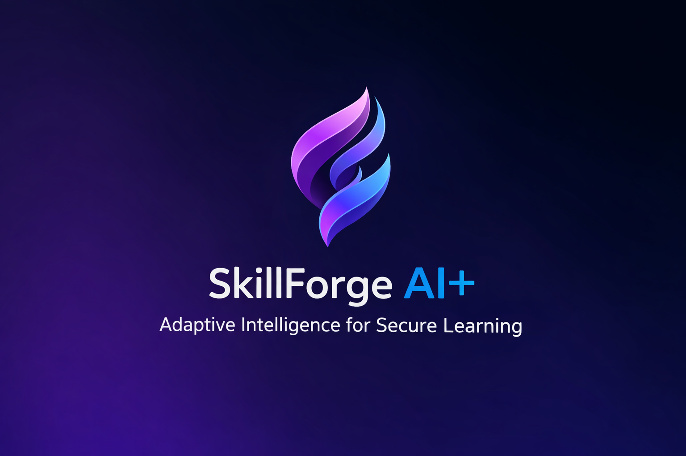

  

<h1 align="center">SkillForge AI+ 
</h1>

  <b>Adaptive Intelligence for Secure Learning</b>

  Forge skills • Secure learning • Scale without limits

---

## Problem

Students and developers today face multiple challenges:

- Difficulty in understanding complex technical concepts  
- Excessive time spent debugging code  
- Static, non-personalized learning platforms  
- Low engagement and burnout  
- Poor accessibility in rural and low-bandwidth regions  
- Unsafe execution of unknown or untrusted code  

Most existing tools behave like generic chatbots rather than intelligent learning systems.

---

## Solution

SkillForge AI+ is a cloud-native, AI-powered learning and developer productivity ecosystem that:

- Adapts to each learner’s strengths and weaknesses  
- Explains concepts visually and in simple terms  
- Provides real-time coding assistance  
- Detects fatigue and recommends breaks  
- Executes code securely inside sandboxes  
- Works offline and supports regional languages  
- Scales efficiently across Bharat using AWS  

It is not just a tutor.  
It functions as a complete intelligent learning operating system.

---

## Key Innovations

- Learning Quotient (LQ) – measures learning efficiency  
- Coding Productivity Score (CPS) – measures debugging speed  
- Fatigue Recovery Index (FRI) – detects burnout and cognitive fatigue  
- Adaptive Roadmap Algorithm (ARA) – personalizes learning paths  
- Secure sandbox execution environment  
- Cloud-native AWS architecture  

---

## Core Capabilities

- AI Pair Programming Buddy  
- Smart Code Debugger  
- Automatic Notes and Quiz Generator  
- Gamification and Leaderboards  
- Career Guidance Engine  
- Multilingual and Offline Mode  
- Secure Code Execution Environment  

---

## Built on AWS

- Amazon S3  
- CloudFront  
- API Gateway  
- AWS Lambda  
- Amazon RDS  
- SageMaker  
- Cognito  
- IAM  

Designed to support 10,000+ concurrent learners with serverless scalability.

---

## Security First

- Encrypted storage  
- Secure sandbox containers  
- Role-based access control  
- Threat detection mechanisms  
- Audit logging and monitoring  

---
## Architecture Snapshot

View High-level cloud-native design of SkillForge AI+ here:

[Cloud Architecture](architecture/cloud_architecture.png)

Designed using AWS serverless infrastructure for scalability and reliability.

## Social Impact

Designed specifically for Bharat:

- Regional language support  
- Low-bandwidth optimization  
- Offline learning packs  
- Accessibility-first design  

---

## Documentation Structure

- requirements.md  
- design.md  
- docs/  
- architecture/  
- ppt/  

---

## Demo & Screenshots

View complete demo here:  
[Open Demo Screens & Notes](demo/demo-notes.md)

Includes:
• Authentication flow  
• Dashboard  
• Learning Studio  
• Smart Debugger  
• Challenges  
• Settings  
• Desktop view  
• Mobile responsive view

## Why SkillForge AI+ is Different

Unlike generic AI tutors, SkillForge AI+ provides:

• Adaptive learning paths  
• Real-time debugging assistance  
• Gamified engagement  
• Secure sandbox execution  
• Cloud-native scalability  
• Accessibility-first design  

This makes it a complete learning ecosystem rather than a simple chatbot.

## Team

INNO-V-A-TORS
- [Amita Narayanan Kutty](https://github.com/Amita-NK)
- [Nedurumalli Ved Varshith Reddy](https://github.com/Varshith78)

