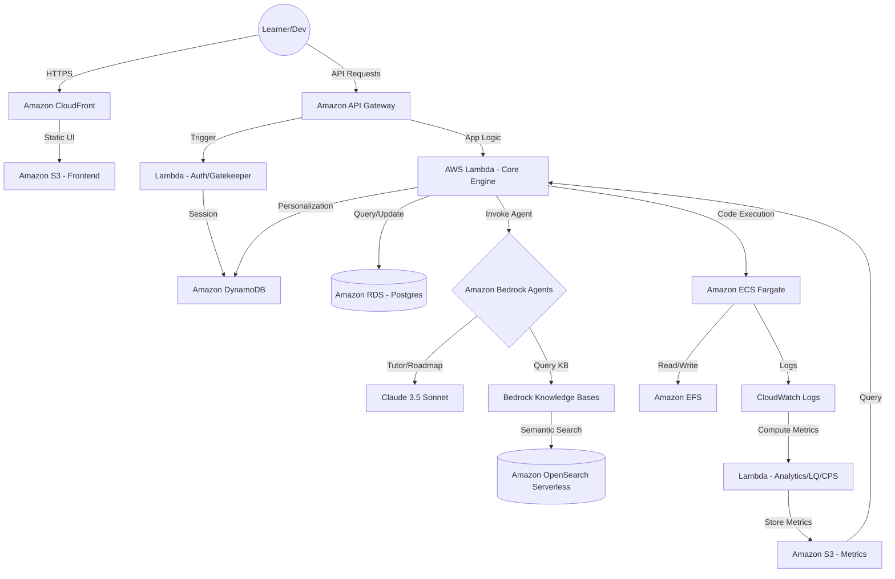

# SkillForge AI+ Architecture Design

## ☁️ High-Level AWS Architecture

## 🛠️ Technical Service Mapping

| Component | AWS Service | Role |
| :--- | :--- | :--- |
| **Frontend** | Amplify / S3 + CloudFront | Premium Next.js 16 UI |
| **Public API** | Amazon API Gateway | REST endpoints with Cognito/IAM Auth |
| **Logic Layer** | AWS Lambda | Event-driven microservices for sub-second scaling |
| **Adaptive Brain** | Amazon Bedrock Agents | Orchestrates learning paths & tutoring |
| **RAG System** | Bedrock Knowledge Bases | Grounds AI in validated academic material |
| **Vector DB** | OpenSearch Serverless | Stores semantic embeddings of syllabuses |
| **Session Memory** | Amazon DynamoDB | Millisecond latency for learner state/preferences |
| **Sandbox** | Amazon ECS Fargate | Secure, isolated multi-tenant code execution |
| **Global Storage** | Amazon S3 | Tiered storage for massive content & audit logs |
| **Shared Disk** | Amazon EFS | Used by Fargate for persistent VSCode-like sessions |

## ⚡ Load-Bearing GenAI Workflows

### 1. The "Adaptive Roadmap" Loop
1. User requests a goal (e.g., "Master AWS Lambda").
2. **Bedrock Agent** fetches user history from **DynamoDB**.
3. Agent queries **Knowledge Base** for prerequisite nodes.
4. Agent generates a personalized JSON roadmap stored in **S3**.
5. UI renders the roadmap dynamically.

### 2. The "Secure Debug" Flow
1. User hits "Debug" button in Code Editor.
2. Code is sent to **Lambda**, which identifies dependencies.
3. Lambda spins up a **Fargate Task** (pre-warmed container).
4. Code executes; output/errors are streamed to **CloudWatch**.
5. **Bedrock** reads output, explains the fix, and suggests a `CPS` score.
